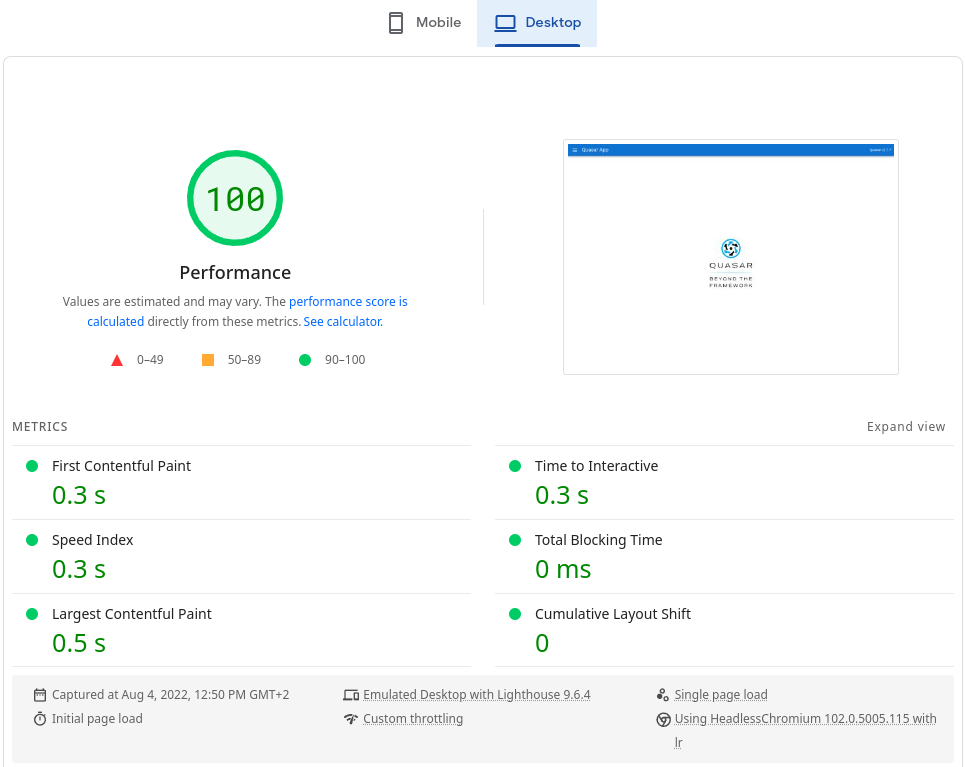

# Static Site Generator App Extension for Quasar v2, the Vue.js Framework

> A [Quasar v2](https://quasar.dev/) App Extension to generate static site AKA [JAMstack](https://jamstack.org).

> :new: Supports Vite since [v4.4.0](https://github.com/freddy38510/quasar-app-extension-ssg/compare/v4.3.0...v4.4.0).

    [](http://commitizen.github.io/cz-cli/)

This project was created to fill this [Feature Request](https://github.com/quasarframework/quasar/issues/2299) from Quasar.

:warning: Looking for [Quasar v1](https://v1.quasar.dev/) with Vue 2 ? See corresponding [quasar-app-extension-ssg v2](https://github.com/freddy38510/quasar-app-extension-ssg/tree/2.x) documentation instead of latest version.

[Live Demo](#live-demo) | [Installing](#installing) | [Uninstalling](#uninstalling) | [Upgrading](#upgrading) | [Developing](#developing) | [Usage](#usage) | [Configuration](#configuration) | [Infos](#infos)

## Live Demo

A live demo built from a fresh new [Quasar project (with Vite)](demos/quasar-ssg-vite) is available at [https://quasar-app-extension-ssg-vite.netlify.app](https://quasar-app-extension-ssg-vite.netlify.app/).

The demo achieves a [Google PageSpeed ​​Insights](https://pagespeed.web.dev) score of **100** for mobile and desktop platforms.

<details>
  <summary>View mobile report</summary>

[](https://pagespeed.web.dev/report?url=https%3A%2F%2Fquasar-app-extension-ssg-vite.netlify.app%2F&form_factor=mobile)

</details>

<details>
  <summary>View desktop report</summary>

[](https://pagespeed.web.dev/report?url=https%3A%2F%2Fquasar-app-extension-ssg-vite.netlify.app%2F&form_factor=desktop)

</details>

## Installing

Run this command into the Quasar project:

```bash
quasar ext add ssg
```

This will find and install the extension’s module. Once the installation is complete, interactive [prompts](#prompts) will wait for responses.

### Prompts

<details>
  <summary>Vite</summary>

- `add scripts into package.json?`: Extends package.json by adding scripts.

  ```javascript
  scripts: {
    'build:ssg': 'quasar ssg generate',
    'serve:ssg': 'quasar ssg serve dist/ssg'
  }
  ```

- `Inline critical css and async load the rest ?`: Uses [Beastcss](https://github.com/freddy38510/beastcss) to inline critical CSS and async load the rest for each generated page.
</details>

<details>
  <summary>Webpack</summary>

- `add scripts into package.json?`: Extends package.json by adding scripts.

  ```javascript
  scripts: {
    'build:ssg': 'quasar ssg generate',
    'serve:ssg': 'quasar ssg serve dist/ssg'
  }
  ```

- `Inline critical css and async load the rest ?`: Uses [Beastcss](https://github.com/freddy38510/beastcss) to inline critical CSS and async load the rest for each generated page.

- `Inline CSS from Vue SFC <style> blocks ?`: Inlines css from Vue Single-File Component (SFC) `<style>` blocks.
</details>

## Uninstalling

```bash
quasar ext remove ssg
```

## Upgrading

This is done with the same command used for installation:

```bash
quasar ext add ssg
```

## Developing

To develop the extension start by cloning this repository:

```bash
git clone https://github.com/freddy38510/quasar-app-extension-ssg.git && cd quasar-app-extension-ssg
```

Register the App Extension through yarn:

```bash
yarn link
```

Install dependencies:

```bash
yarn
```

Create a new Quasar project then install the App Extension:

```bash
yarn create quasar

cd <project-name>

quasar ext add ssg
```

Finally link the locally developed App Extension:

```bash
yarn link quasar-app-extension-ssg
```

Now the app extension can be developed without uninstalling/installing it every time something changes in it.

## Usage

### Generate

To generate a static site run this command from the quasar project folder:

```bash
quasar ssg generate
```

#### Generate Options

- `-h, --help`: Display usage instructions.
- `--force-build`: Force to build the application with webpack.
- `-d, --debug`: Build for debugging purposes.

### Dev

:new: _Added in [v4.2.0](https://github.com/freddy38510/quasar-app-extension-ssg/compare/v4.1.1...v4.2.0)_

Starts the app in development mode (live reloading, error reporting, etc):

```bash
quasar ssg dev
```

The development server allows to develop the app by compiling and maintaining code in-memory. A web server will serve the app while offering live-reload out of the box. Running in-memory offers faster rebuilds when the code is changed.

The server can be configured by editing the `/quasar.config.js’ file:

```javascript
devServer: {
  host: '...',
  port: ...
}
```

#### Dev Options

- `-h, --help`: Display usage instructions.
- `--port, -p`: A port number on which to start the application.
- `--hostname, -H`: A hostname to use for serving the application.
- `--devtools, -d`: Open remote Vue Devtools.

### Serve

This extension provides a command to create a server to locally test the generated static site:

```bash
quasar ssg serve <dist-folder>
```

> Notes: This server is based on the [Quasar cli server](https://github.com/quasarframework/quasar/blob/dev/cli/bin/quasar-serve) adapted for static site. It serves the SPA fallback file (404.html) when a page has not been generated for a given route.

#### Serve Options

- `--port, -p`: Port to use (default: 4000).
- `--hostname, -H`: Address to use (default: 0.0.0.0).
- `--prefix-path`: Create a virtual path prefix (default: /).
- `--gzip, -g`: Compress content (default: true).
- `--silent, -s`: Suppress log message.
- `--colors`: Log messages with colors (default: true).
- `--open, -o`: Open browser window after starting.
- `--cache, -c <number>`: Cache time (max-age) in seconds. Does not apply to /service-worker.js (default: 86400 - 24 hours).
- `--micro, -m <seconds>`: Use micro-cache (default: 1 second).
- `--https`: Enable HTTPS.
- `--cert, -C [path]`: Path to SSL cert file (Optional).
- `--key, -K [path]`: Path to SSL key file (Optional).
- `--proxy <file.js>`: Proxy specific requests defined in file. File must export Array ({ path, rule }). "rule" is defined at: <https://github.com/chimurai/http-proxy-middleware>.

  ```javascript
  module.exports = [
    {
      path: "/api",
      rule: { target: "http://www.example.org" },
    },
  ];
  // will be transformed into app.use(path, httpProxyMiddleware(rule))
  ```

- `--cors`: Enable CORS for all requests.
- `--help, -h`: Display usage instructions.

### Inspect

This command can be used to inspect the Webpack config generated by this app extension.

```bash
quasar ssg inspect
```

#### Inspect Options

<details>
  <summary>Vite</summary>

- `--cmd, -c`: Quasar SSG command [dev|generate] (default: dev)
- `-d, --depth`: Number of levels deep (default: 2).
- `-p, --path`: Path of config in dot notation.

  Examples:

  ```bash
  quasar ssg inspect -p build.rollupOptions
  quasar ssg inspect -p plugins
  ```

- `--colors`: Style output with ANSI color codes (default: true).
- `--thread, -t`: Display only one specific ssg config thread
- `-h, --help`: Display usage instructions.
</details>

<details>
  <summary>Webpack</summary>

- `-d, --depth`: Number of levels deep (default: 5).
- `-p, --path`: Path of config in dot notation.

  Examples:

  ```bash
  quasar ssg inspect -p module.rules
  quasar ssg inspect -p plugins
  ```

- `--colors`: Style output with ANSI color codes (default: true).
- `-h, --help`: Display usage instructions.
</details>

## Configuration

Options can be passed with `ssg` key in `/quasar.config.js` file.

```javascript
// quasar.config.js

module.exports = function (/* ctx */) {
  return {
    // ...

    ssg: {
      // pass options here
    },

    // ...
  };
};
```

### Webpack

<details>
  <summary>See all available options</summary>

### `concurrency`

Type: `Number`

Default: `10`

Page generation is concurrent, `ssg.concurrency` specifies the amount of page generation that runs in one thread.

### `interval`

Type: `Number`

Default: `0`

Interval in **milliseconds** between two batches of concurrent page generation to avoid flooding a potential API with calls to the API from the web application.

> Notes:
>
> This option is intended to be used in conjunction with the `concurrency` option.
> For example, setting `concurrency` to `10` and `interval` to `5000` will execute the generation of 10 pages in parallel every 5 seconds.

### `routes`

Type: `String[]` or `Function`

Default: `[]`

A list of routes to generate the corresponding pages.

> Note: As of quasar-app-extension-ssg [v2.0.0](https://github.com/freddy38510/quasar-app-extension-ssg/compare/v1.2.0...v2.0.0) this option is optionnal due to the crawler feature and the ability to include static routes from the app's router using the `ssg.includeStaticRoutes` option.
>
> If the app has unlinked pages (such as secret pages) and these also need to be generated, the `ssg.routes` property can be used.

Example:

```javascript
ssg: {
  routes: ["/", "/about", "/users", "/users/someone"];
}
```

With a `Function` which returns a `Promise`:

```javascript
// quasar.config.js

const axios = require("axios");

module.exports = function (/* ctx */) {
  return {
    // ...

    ssg: {
      routes() {
        return axios.get("https://my-api/users").then((res) => {
          return res.data.map((user) => {
            return "/users/" + user.id;
          });
        });
      },
    },

    // ...
  };
};
```

With a `Function` which returns a `callback(err, params)`:

```javascript
// quasar.config.js

const axios = require("axios");

module.exports = function (/* ctx */) {
  return {
    // ...

    ssg: {
      routes(callback) {
        axios
          .get("https://my-api/users")
          .then((res) => {
            const routes = res.data.map((user) => {
              return "/users/" + user.id;
            });
            callback(null, routes);
          })
          .catch(callback);
      },
    },

    // ...
  };
};
```

### `includeStaticRoutes`

:new: _Added in [v4.0.0](https://github.com/freddy38510/quasar-app-extension-ssg/compare/v3.4.0...v4.0.0)_

Type: `Boolean`

Default: `true`

Include the application's router static routes to generate the corresponding pages.

> Note: In case of warnings issued when initializing routes, this option can be disabled. Then the `crawler` feature and the `ssg.routes` options can be used to provide the static and dynamic routes.

### `distDir`

:new: _Added in [v4.2.0](https://github.com/freddy38510/quasar-app-extension-ssg/compare/v4.1.1...v4.2.0)_

Type: `String`

Default: `'<project-folder>/dist/ssg'`

Folder where the extension should generate the distributables. Relative path to project root directory.

### `buildDir`

Type: `String`

Default: `'<project-folder>/node_modules/.cache/quasar-app-extension-ssg'` or `'<project-folder>/.ssg-build'` if `cache` is set to false.

The webpack compilation output folder from where the extension can prerender pages.

### `cache`

Type: `Object` or `false`

Default:

```javascript
{
  ignore: [
    join(conf.ssg.distDir, '/**'), // dist/ssg
    join(conf.ssg.buildDir, '/**'), // node_modules/.cache/quasar-app-extension-ssg
    ...conf.build.distDir ? [join(conf.build.distDir, '/**')] : [],
    'dist/**',
    'public/**',
    'src-ssr/**',
    'src-cordova/**',
    'src-electron/**',
    'src-bex/**',
    'node_modules/**',
    '.**/*',
    '.*',
    'README.md'
  ],
  globbyOptions: {
    gitignore: true
  }
}
```

This option caches the compilation output folder and skips recompilation when no tracked file has changed.

- `ignore` is a [Globby](https://github.com/sindresorhus/globby#patterns) patterns to ignore tracked files. If an array is provided, it will be merged with default options. A function can be passed to return an array that will remove the defaults.

  Example with an `Array`:

  ```javascript
  ssg: {
    cache: {
      ignore: ["renovate.json"]; // ignore changes applied on this file
    }
  }
  ```

  With a `Function`:

  ```javascript
  ssg: {
    cache: {
      ignore: (defaultIgnore) =>
        defaultIgnore.push("renovate.json") && defaultIgnore;
    }
  }
  ```

- `globbyOptions` can be used to add [globby options](https://github.com/sindresorhus/globby#options).

### `fallback`

Type: `String`

Default: `'404.html'`

The name of the SPA/PWA fallback file intended to be served when an index.html file does not exist for a given route.

> Notes:
>
> - Overrides `build.htmlFilename` and `build.ssrPwaHtmlFilename`.
> - This file is created with the webpack plugin [`html-webpack-plugin`](https://github.com/jantimon/html-webpack-plugin) via [this Quasar file](https://github.com/quasarframework/quasar/blob/dev/app-webpack/lib/webpack/inject.html.js). It can be extended with some [plugins](https://github.com/jantimon/html-webpack-plugin#plugins).
> - Multiple services (e.g. Netlify, Vercel) detect a 404.html automatically. For custom web server, an error page must be set up and set to the 404.html file.

### `crawler`

:new: _Added in [v2.0.0](https://github.com/freddy38510/quasar-app-extension-ssg/compare/v1.2.0...v2.0.0)_

Type: `Boolean`

Default: `true`

Crawls html links as each page is generated to find dynamic and static routes to add to the page generation queue.

### `exclude`

:new: _Added in [v2.0.0](https://github.com/freddy38510/quasar-app-extension-ssg/compare/v1.2.0...v2.0.0)_

Type: `String[] | Regexp[]`

An array of routes or regular expressions matching them to prevent corresponding pages from being generated.

Example with an `Array of String`:

```javascript
ssg: {
  exclude: ["/my-secret-page"];
}
```

With an `Array of Regexp`:

```javascript
ssg: {
  exclude: [
    /^\/admin/, // path starts with /admin
  ];
}
```

### `shouldPreload(file, type, ext, isLazilyHydrated)`

:new: _Added in [v3.3.0](https://github.com/freddy38510/quasar-app-extension-ssg/compare/v3.2.1...v3.3.0)_

Type: `Function`

A function to control what files should have <link rel="preload"> resource hints generated.

By default, no assets will be preloaded.

Example to preload assets:

```javascript
ssg: {
  shouldPreload: (file, type, ext) => {
    // type is inferred based on the file extension.
    // https://fetch.spec.whatwg.org/#concept-request-destination
    if (type === "script" || type === "style") {
      return true;
    }
    if (type === "font" && ext === "woff2") {
      // only preload woff2 fonts
      return file;
    }
    if (type === "image") {
      // only preload important images
      return file === "hero.jpg";
    }
  };
}
```

### `shouldPrefetch(file, type, ext, isLazilyHydrated)`

:new: _Added in [v3.3.0](https://github.com/freddy38510/quasar-app-extension-ssg/compare/v3.2.1...v3.3.0)_

Type: `Function`

A function to control what files should have <link rel="prefetch"> resource hints generated.

By default no assets will be prefetched. However this is possible to customize what to prefetch in order to better control bandwidth usage. This option expects the same function signature as shouldPreload.

### `inlineCriticalCss`

Type: `Boolean` or `Object`

Default: `true`

Uses [Beastcss](https://github.com/freddy38510/beastcss) to inline critical CSS and async load the rest for each generated page.

The default beastcss options can be customized by passing them to `inlineCriticalCss`.

Example:

```javascript
ssg: {
  inlineCriticalCss: {
    internal: false,
    merge: false,
  };
}
```

> Notes:
>
> The value is forced to `false` when using the [dev](#dev) command.

### `inlineCssFromSFC`

:new: _Added in [v3.3.0](https://github.com/freddy38510/quasar-app-extension-ssg/compare/v3.2.1...v3.3.0)_

Type: `Boolean`

Default: `false`

Inline css from Vue Single-File Component (SFC) `<style>` blocks.

Note: This option works even if build.extractCSS is set to `true` in quasar.config.js file.

> Notes:
>
> The value is forced to `true` when using the [dev](#dev) command.

### `onRouteRendered(html, route, distDir)`

Type: `Function`

Hook executed after pre-rendering a page just before writing it to the filesystem.

This function must return the html string.

Can use async/await or directly return a Promise.

### `afterGenerate(files, distDir)`

Type: `Function`

Hook executed after all pages has been generated.

Can use async/await or directly return a Promise.

> Note: The `files` parameter is an `Array` of all generated page paths + filenames (including the fallback file).

</details>

### Vite

<details>
  <summary>See all available options</summary>

### `concurrency`

Type: `Number`

Default: `10`

Page generation is concurrent, `ssg.concurrency` specifies the amount of page generation that runs in one thread.

### `interval`

Type: `Number`

Default: `0`

Interval in **milliseconds** between two batches of concurrent page generation to avoid flooding a potential API with calls to the API from the web application.

> Notes:
>
> This option is intended to be used in conjunction with the `concurrency` option.
> For example, setting `concurrency` to `10` and `interval` to `5000` will execute the generation of 10 pages in parallel every 5 seconds.

### `routes`

Type: `String[]` or `Function`

Default: `[]`

A list of routes to generate the corresponding pages.

> Note: This option is optionnal due to the crawler feature and the ability to include static routes from the app's router using the `ssg.includeStaticRoutes` option.
>
> If the app has unlinked pages (such as secret pages) and these also need to be generated, the `ssg.routes` property can be used.

Example:

```javascript
ssg: {
  routes: ["/", "/about", "/users", "/users/someone"];
}
```

With a `Function` which returns a `Promise`:

```javascript
// quasar.config.js

const axios = require("axios");

module.exports = function (/* ctx */) {
  return {
    // ...

    ssg: {
      routes() {
        return axios.get("https://my-api/users").then((res) => {
          return res.data.map((user) => {
            return "/users/" + user.id;
          });
        });
      },
    },

    // ...
  };
};
```

With a `Function` which returns a `callback(err, params)`:

```javascript
// quasar.config.js

const axios = require("axios");

module.exports = function (/* ctx */) {
  return {
    // ...

    ssg: {
      routes(callback) {
        axios
          .get("https://my-api/users")
          .then((res) => {
            const routes = res.data.map((user) => {
              return "/users/" + user.id;
            });
            callback(null, routes);
          })
          .catch(callback);
      },
    },

    // ...
  };
};
```

### `includeStaticRoutes`

Type: `Boolean`

Default: `true`

Include the application's router static routes to generate the corresponding pages.

> Note: In case of warnings issued when initializing routes, this option can be disabled. Then the [`crawler`](#crawler) feature and the [`ssg.routes`](#routes) options can be used to provide the static and dynamic routes.

### `distDir`

Type: `String`

Default: `'<project-folder>/dist/ssg'`

Folder where the extension should generate the distributables. Relative path to project root directory.

### `compilationDir`

Type: `String`

Default: `'<project-folder>/node_modules/.cache/quasar-app-extension-ssg'` or `'<project-folder>/.ssg-compilation'` if `cache` is set to false.

The Vite compilation output folder from where the extension can prerender pages.

### `cache`

Type: `Object` or `false`

Default:

```javascript
{
  ignore: [
    join(conf.ssg.distDir, '/**'), // dist/ssg
    join(conf.ssg.compilationDir, '/**'), // node_modules/.cache/quasar-app-extension-ssg
    join(conf.build.distDir, '/**'),
    'dist/**',
    'public/**',
    'src-ssr/**',
    'src-cordova/**',
    'src-electron/**',
    'src-bex/**',
    'node_modules/**',
    '.**/*',
    '.*',
    'README.md'
  ],
  globbyOptions: {
    gitignore: true
  }
}
```

This option caches the compilation output folder and skips recompilation when no tracked file has changed.

- `ignore` is a [Globby](https://github.com/sindresorhus/globby#patterns) patterns to ignore tracked files. If an array is provided, it will be merged with default options. A function can be passed to return an array that will remove the defaults.

  Example with an `Array`:

  ```javascript
  ssg: {
    cache: {
      ignore: ["renovate.json"]; // ignore changes applied on this file
    }
  }
  ```

  With a `Function`:

  ```javascript
  ssg: {
    cache: {
      ignore: (defaultIgnore) =>
        defaultIgnore.push("renovate.json") && defaultIgnore;
    }
  }
  ```

- `globbyOptions` can be used to add [globby options](https://github.com/sindresorhus/globby#options).

### `fallback`

Type: `String`

Default: `'404.html'`

The name of the SPA/PWA fallback file intended to be served when an index.html file does not exist for a given route.

> Notes:
>
> - Overrides `build.htmlFilename` and `build.ssrPwaHtmlFilename`.
> - This file is created with the webpack plugin [`html-webpack-plugin`](https://github.com/jantimon/html-webpack-plugin) via [this Quasar file](https://github.com/quasarframework/quasar/blob/dev/app-webpack/lib/webpack/inject.html.js). It can be extended with some [plugins](https://github.com/jantimon/html-webpack-plugin#plugins).
> - Multiple services (e.g. Netlify, Vercel) detect a 404.html automatically. For custom web server, an error page must be set up and set to the 404.html file.

### `crawler`

Type: `Boolean`

Default: `true`

Crawls html links as each page is generated to find dynamic and static routes to add to the page generation queue.

### `exclude`

Type: `String[] | Regexp[]`

An array of routes or regular expressions matching them to prevent corresponding pages from being generated.

Example with an `Array of String`:

```javascript
ssg: {
  exclude: ["/my-secret-page"];
}
```

With an `Array of Regexp`:

```javascript
ssg: {
  exclude: [
    /^\/admin/, // path starts with /admin
  ];
}
```

### `shouldPreload({ file, type, extension, isLazilyHydrated })`

Type: `Function`

A function to control what files should have <link rel="preload"> resource hints generated.

By default, no assets will be preloaded.

Example to preload assets:

```javascript
ssg: {
  shouldPreload: ({ file, type, extension, isLazilyHydrated }) => {
    // type is inferred based on the file extension.
    // https://fetch.spec.whatwg.org/#concept-request-destination
    if (type === "script" || type === "style") {
      return true;
    }

    if (type === "font" && ext === "woff2") {
      // only preload woff2 fonts
      return file;
    }

    if (type === "image") {
      // only preload important images
      return file === "hero.jpg";
    }

    // do not preload anything else
    return false;
  };
}
```

### `shouldPrefetch({ file, type, extension, isLazilyHydrated })`

Type: `Function`

A function to control what files should have <link rel="prefetch"> resource hints generated.

By default no assets will be prefetched. However this is possible to customize what to prefetch in order to better control bandwidth usage. This option expects the same function signature as shouldPreload.

### `inlineCriticalCss`

Type: `Boolean` or `Object`

Default: `true`

Uses [Beastcss](https://github.com/freddy38510/beastcss) to inline critical CSS and async load the rest for each generated page.

The default beastcss options can be customized by passing them to `inlineCriticalCss`.

Example:

```javascript
ssg: {
  inlineCriticalCss: {
    internal: false,
    merge: false,
  };
}
```

> Notes:
>
> The value is forced to `false` when using the [dev](#dev) command.

### `onPageGenerated({ html, route, path })`

Type: `Function`

Hook executed after pre-rendering a page just before writing it to the filesystem. This hook can be used to update html string and/or the generated page output path.

This function must return an `Object` containing `html` and `path` properties.

Can use async/await or directly return a Promise.

Example:

```js
const { join, sep } = require('path');

// skipped code...

ssg: {
  onPageGenerated(page) {
    // do not write generated pages in subfolders

    // replace dist/ssg/some-route/index.html
    // by dist/ssg/some-route.html

    const normalizedRoute = page.route.replace(/\/$/, '');

    const fileName = page.route.length > 1 ? join(sep, normalizedRoute + '.html') : join(sep, 'index.html')

    return {
      html: page.html,
      path: page.path.replace(join(page.route, 'index.html'), fileName),
    };
  },
}
```

### `afterGenerate(files, distDir)`

Type: `Function`

Hook executed after all pages has been generated.

Can use async/await or directly return a Promise.

> Note: The `files` parameter is an `Array` of all generated page paths + filenames (including the fallback file).

</details>

## Tips

### Lazy/partial Hydration

It is possible to lazy hydrate components using the [vue3-lazy-hydration](https://github.com/freddy38510/vue3-lazy-hydration) package.

In production, when generating pages, the extension does not inject script/preload tags for split chunks corresponding to lazily hydrated components. In this way, these components are loaded client-side, on-demand, when hydration occurs.

### Identify running mode

Since the version [v4.0.0](https://github.com/freddy38510/quasar-app-extension-ssg/compare/v3.4.0...v4.0.0) the value of `process.env.MODE` is `ssg` when the app was built with the command `quasar ssg generate` or `quasar ssg dev`.

Below [v4.0.0](https://github.com/freddy38510/quasar-app-extension-ssg/tree/v4.0.0), `process.env.STATIC` can be used instead.

It could be useful if multiple builds are mixed with different modes to differentiate runtime procedures.

## Infos

### About Boot File

This Extension uses a boot file [`ssg-corrections.js`](https://github.com/freddy38510/quasar-app-extension-ssg/blob/master/src/boot/ssg-corrections.js) at client-side to apply corrections to the [`<body>` tag classes](https://quasar.dev/style/body-classes#introduction).

This is necessary because the running [platform](https://quasar.dev/options/platform-detection#introduction) is unknown at build time.

### About PWA

SSG + PWA can be enabled by setting `ssr.pwa` to `true` inside `quasar.config.js` file.

<details>
  <summary>Vite</summary>

Quasar uses [workbox-build](https://github.com/GoogleChrome/workbox/tree/v6/packages/workbox-build) package to generate a complete service worker and a list of assets to precache which is injected into the service worker file.

This means that all generated pages cannot be precached when Vite is compiling because they do not yet exist at this time.
To fix this, **when running the [generate](#generate) command**, the extension moves the execution of [workbox-build](https://github.com/GoogleChrome/workbox/tree/v6/packages/workbox-build) methods after all pages have been generated.

</details>

<details>
  <summary>Webpack</summary>

Quasar uses [workbox-webpack-plugin](https://github.com/GoogleChrome/workbox/tree/v6/packages/workbox-webpack-plugin) package to generate a complete service worker and a list of assets to precache which is injected into the service worker file.

This means that all generated pages cannot be precached when webpack is compiling because they do not yet exist at this time.
To fix this, **when running the [generate](#generate) command**, the extension instead uses [workbox-build](https://github.com/GoogleChrome/workbox/tree/v6/packages/workbox-build) package after all pages have been generated.

Therefore, [workbox-build](https://developers.google.com/web/tools/workbox/modules/workbox-build) options must be passed in the key `pwa.workboxOptions` of `quasar.config.js` file instead of the [workbox-webpack-plugin](https://developers.google.com/web/tools/workbox/modules/workbox-webpack-plugin) options. All other PWA options of the `pwa` key in the `quasar.config.js` file are valid and used according to the [Quasar documentation](https://quasar.dev/quasar-cli/developing-pwa/configuring-pwa#quasar-conf-js).

</details>

### About Cache Feature

The cache mechanism to avoid recompiling the app when it is not necessary is strongly inspired by [Nuxt](https://nuxtjs.org).
See the Nuxt [blog post](https://fr.nuxtjs.org/blog/nuxt-static-improvements#faster-static-deployments) about this feature.
