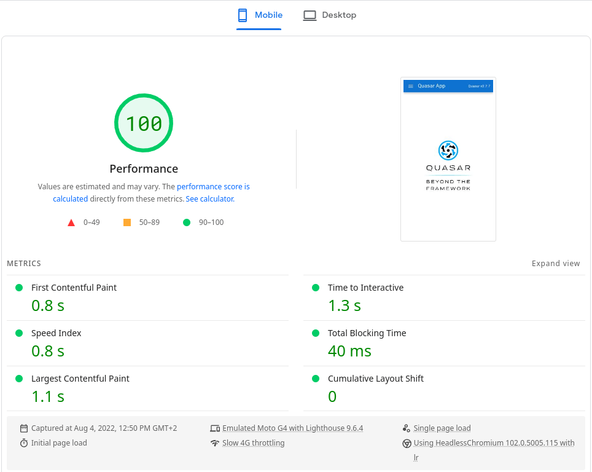
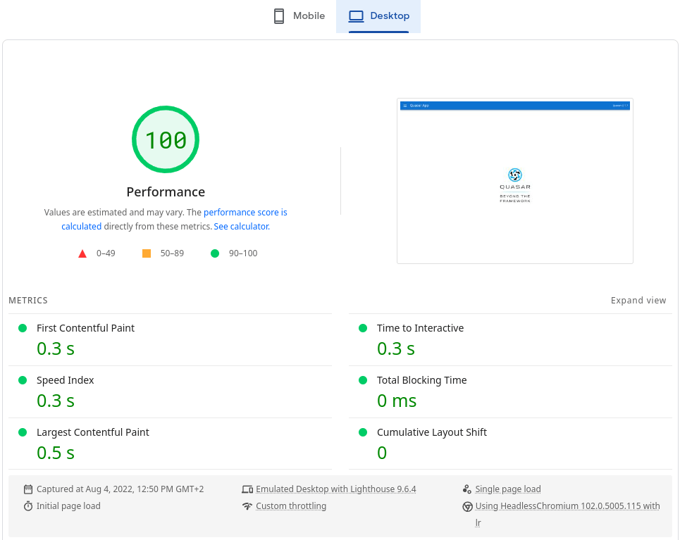

# [Demo Quasar-app-extension-ssg with vite](https://quasar-app-extension-ssg-vite.netlify.app/)

A demo for Quasar project with quasar-app-extension-ssg for vite.

## PageSpeed Insights reports

### mobile

[](https://pagespeed.web.dev/report?url=https%3A%2F%2Fquasar-app-extension-ssg-vite.netlify.app%2F&form_factor=mobile)

### desktop

[](https://pagespeed.web.dev/report?url=https%3A%2F%2Fquasar-app-extension-ssg-vite.netlify.app%2F&form_factor=desktop)

## Install the dependencies

```bash
yarn
# or
npm install
```

### Start the app in development mode (hot-code reloading, error reporting, etc.)

```bash
quasar ssg dev
```

### Lint the files

```bash
yarn lint
# or
npm run lint
```

### Format the files

```bash
yarn format
# or
npm run format
```

### Build the app for production

```bash
quasar ssg generate
```

### Customize the configuration

See [Configuring quasar.config.js](https://v2.quasar.dev/quasar-cli-vite/quasar-config-js) and [configuring quasar-app-extension-ssg for Vite](https://github.com/freddy38510/quasar-app-extension-ssg#vite).
